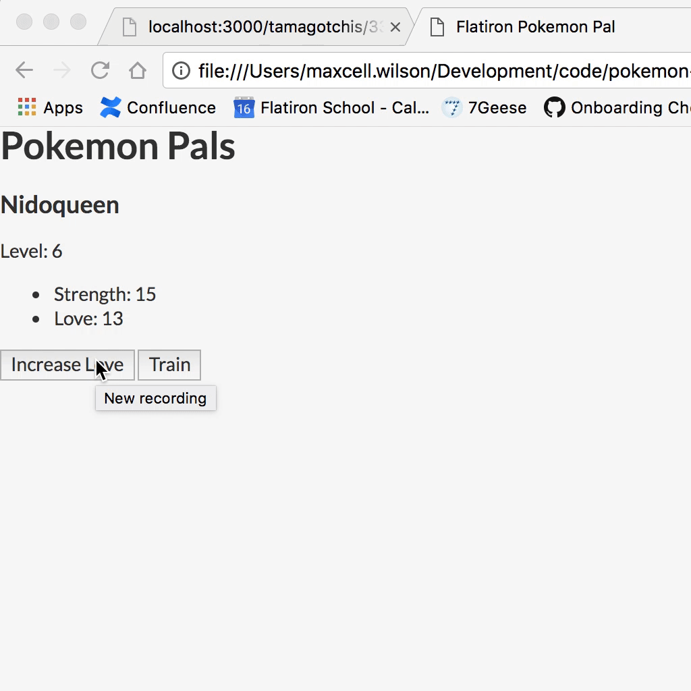

# Flatiron Pokemon Pal

You're building the next greatest app for Flatiron School called, "Flatiron Pokemon Pal".
Your task is to take a pre-built backend (don't worry, we will give you the documentation
to the backend), and use it to display wondrous Pokemon and make sure
they can exercise and get love. Below you'll have an example of the implementation and from
there you will need to recreate it.

## Example



## Deliverables
Your tasks include the following:
- As a user, when the page **loads** I should see **a single** Pokemon.
- As a user clicks on the Give Love button, it should increment the love value by one. This should be persisted in the remote API as well.
- As a user clicks on the Exercise button, it should increment the strength value by one. This should be persisted in the remote API as well.

## Implementation Notes

### The Page
Just be sure to change the elements on the page as necessary. **YOU DO NOT NEED TO DYNAMICALLY ADD /ALL/
Pokemon**.

### The API
All requests will run through this base url: `https://pokemon-pals.herokuapp.com/`

You will then make sure append whatever resource you are using moving forward through this document, such as `/pokemons`, `/love`, or `/strength`.

#### GET `/pokemons/:id`
You will get Pokemon's by ID. **You can use an ID of 1 if you like**. You will have anywhere from 1 to 10.

```
# Example Requests
GET /pokemons/:id

# Example Response
{
	"id": 2,
	"name": "Dragonite",
	"level": 7,
	"love": 7,
	"strength": 9,
	"created_at": "2018-02-14T22:25:35.495Z",
	"updated_at": "2018-02-14T22:29:11.168Z"
}
```

#### POST `/love`
This route allows you to increase the love of a pokemon by one. You will only
need to send in the `pokemon_id` as an integer in the body of the request.

```
# Example Request
POST /love

Required Headers
{
  'Content-Type': 'application/json'
}

Required Body
{
	"pokemon_id": 2
}

# Example Response
{
	"love": 8,
	"id": 2,
	"name": "Dragonite",
	"level": 7,
	"strength": 9,
	"created_at": "2018-02-14T22:25:35.495Z",
	"updated_at": "2018-02-14T22:30:28.206Z"
}
```

### POST `/train`
This route allows you to increase the strength of a Pokemon by one. You will only
need to send in the `pokemon_id` as an integer in the body of the request.

```
# Example Request
POST /train

Required Headers
{
  'Content-Type': 'application/json'
}

Required Body
{
  "pokemon_id": 2
}

# Example Response
{
	"strength": 10,
	"id": 2,
	"name": "Dragonite",
	"level": 7,
	"love": 8,
	"created_at": "2018-02-14T22:25:35.495Z",
	"updated_at": "2018-02-14T22:30:42.717Z"
}
```
